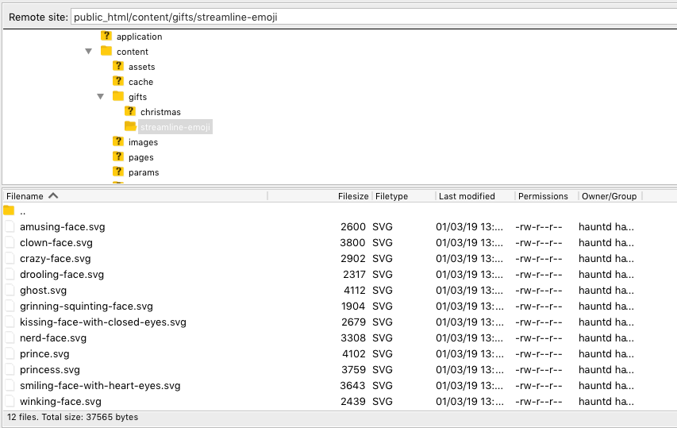
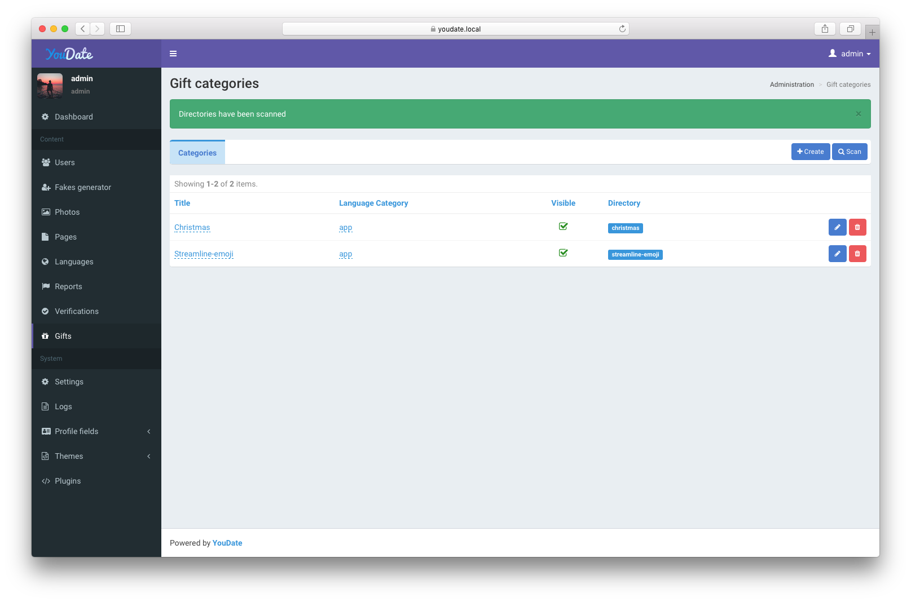
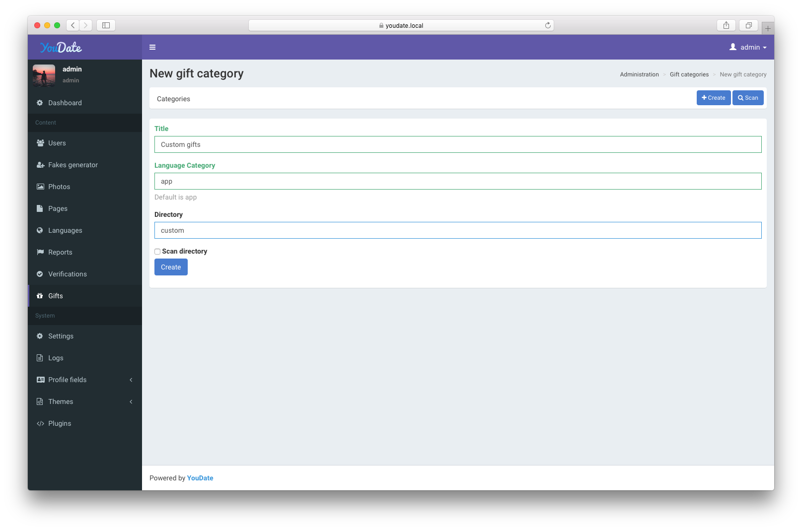
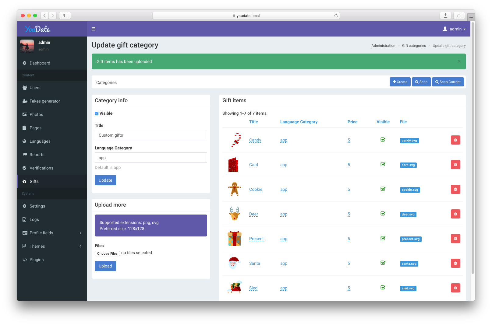

### Overview

Gifts feature is a way to attract the attention of users. They can be both free and paid, private or public.

Admins are able to add more categories, hide ones, add/remove gifts items from categories and set prices.

Typical gift is a graphical file (png or svg, 128x128 preferred), which are located in `content/gifts/%giftCategory%` directory.

For example:

``` sh
.
├─ content/
│  └─ gifts/
|     └─ christmass/
|        └─ new-year-tree.png
|        └─ santa.png
|     └─ greetings/
|        └─ hello.svg
|        └─ heart.svg
```

### Adding more gifts

You can add more gift categories/items in two ways:

#### Scan directory

Upload your gifts directory with png/svg files to `content/gifts` directory:

[](./images/adminGiftsScan.png)

Then click **Scan** button and app will detect all new files and add to your collection:

[](./images/adminGiftsScan2.png)

#### Manual adding

Create a new category:

[](./images/adminGiftsManual.png)

Add files and click Upload button:

[](./images/adminGiftsManual2.png)

