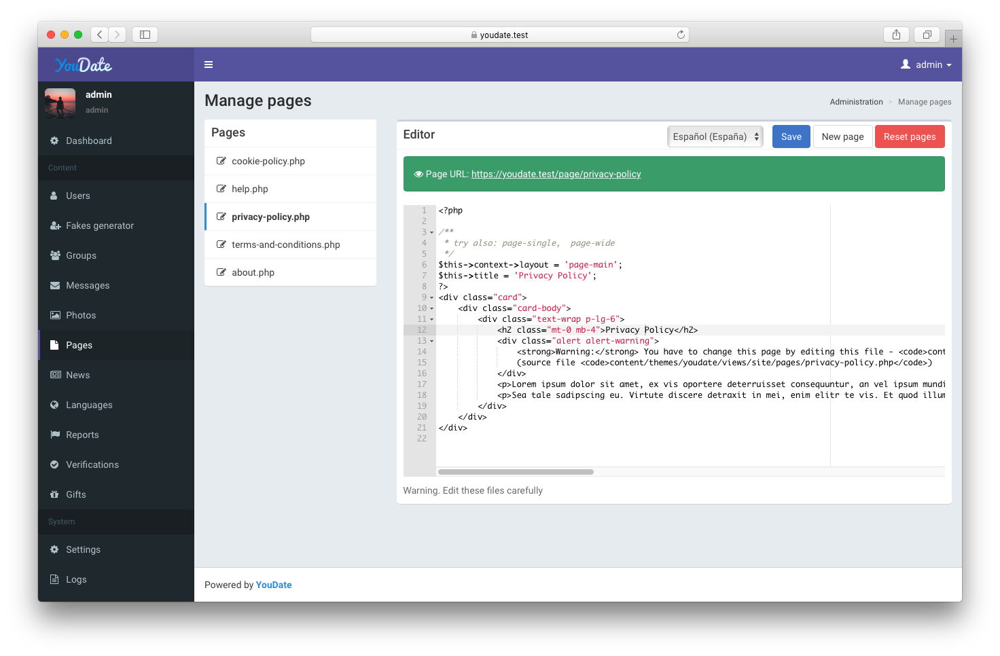

### Access

To access the administration area of your website, find a link called "Administration" in the header menu 
or use the administrator's URL that was entered in the installer (default is `admin`, so it will be like `https://youdate.test/admin`).

!!! info "Info"
    To find out which URL is used, check your `.env` config file and find **`ADMIN_PREFIX`** key.

### Content

**Dashboard** shows most important counters, info, charts, system status.

**Users** management allows you to find users, update their information, block or delete profiles entirely.
Also you can add/remove admin rights, add credits to their balance, toggle verification badge.

**Photos** management. Default scope shows unverified photos first. You can turn moderation off in the `"Settings > Photos"`.

**Pages** management. Please note that you have to edit these files carefully - PHP code in this files will be executed; broken HTML structure will affect the resulting view.
Also, you have an option to reset pages (restore all page files from the current theme).

**Languages** management allows you to add more languages, translate the script and theme files.

**Reports** management allows you to review all the reports and make verdicts (block users or mark report with "viewed" flag).

**Verifications** management allows you to review all the verification requests and make verdicts (add verification badge or not).

### Settings

**Main** settings includes such params like (but not limited to):

* site name
* site language
* meta tags, meta description
* header html/css/js code (before `</head>` tag)
* footer html/css/js/analytics code (before `</body>` tag)
* and so on

**Photos** settings includes photo-related options: min width/height, moderation on/off, max file size.

**Payment** settings includes currency options, Stripe and PayPal integration params (api keys/secrets).

**Prices** settings for premium, boost features and their duration.

**Cached data** allows you to flush app's cached data and compiled assets.
