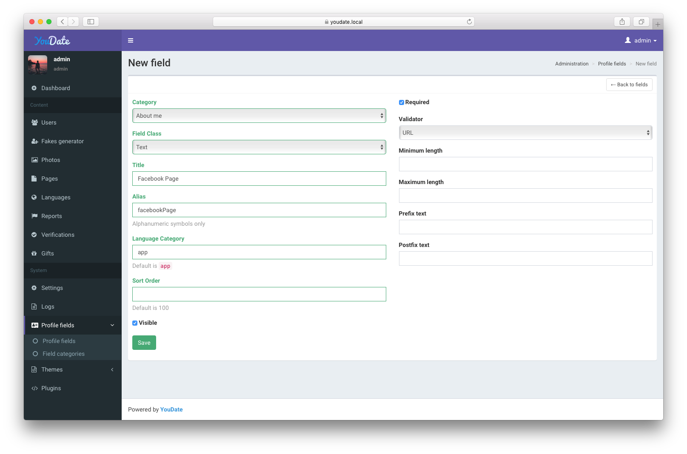
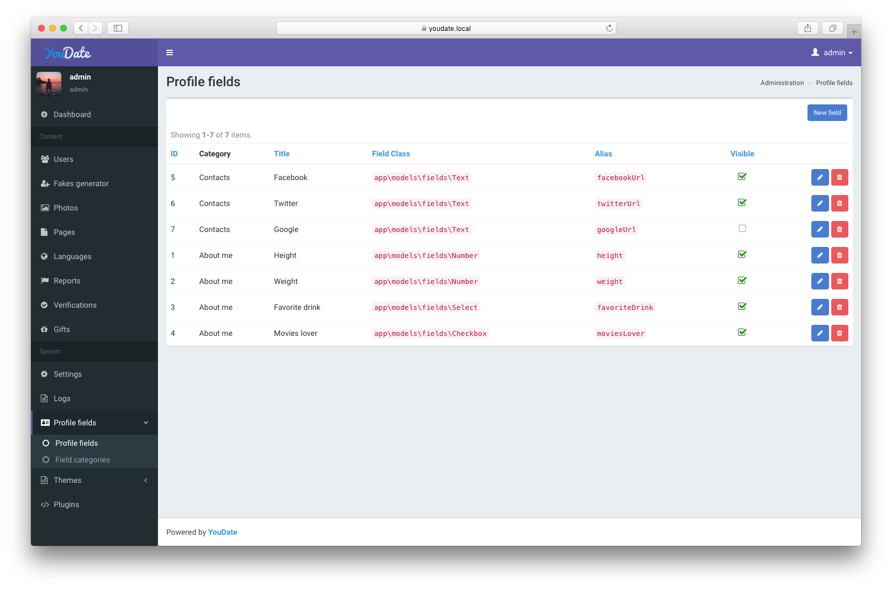

### Categories

To create additional profile fields you need to create a category first. Navigate to `Admin > Profile fields > Field categories`
and create a category (at least one).

Default value for **Language category** is `app`, sort order is `100`.

Alias name must be contain alphanumeric symbols, for example: `aboutMe`. 

### Fields

Now, when you have a category, you can add custom profile fields.

Supported types are: text, textarea, number, select list, checkbox.

After creating/editing profile fields it's highly recommended to reset app cache in `Admin > Settings > Cached data`.

