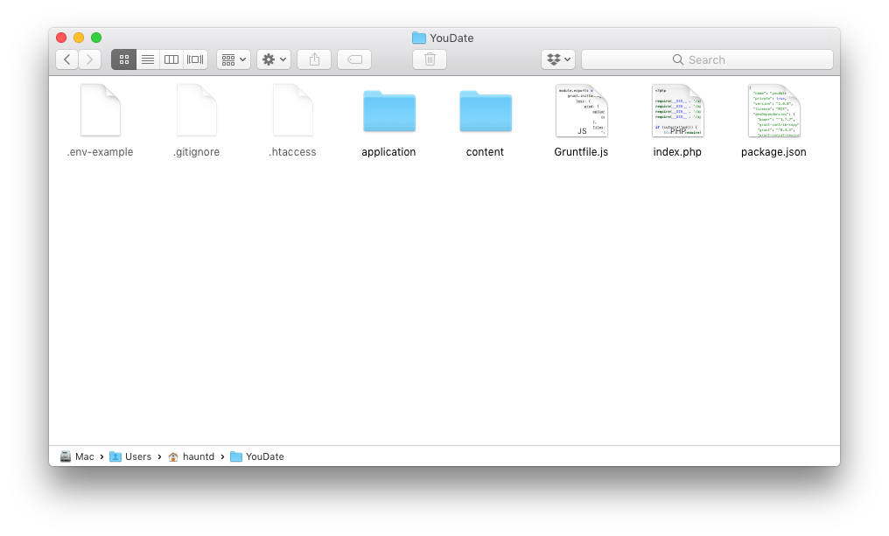

### Files structure

Script source files are in `Source/youdate.zip` file. The structure of the project is:

``` sh
.
├─ application/                        # Script core files
├─ content/                            # All your content
│  ├─ assets/                          # Compiled and cached assets (css/js)
│  ├─ cache/                           # Cached photos and thumbnails
│  ├─ gifts/                           # Gifts
│  ├─ images/                          # Images
│  ├─ pages/                           # Site pages
│  ├─ params/                          # Site params and configs
│  ├─ photos/                          # User photos
│  ├─ plugins/                         # Plugins
│  └─ themes/                          # Themes
|     └─ youdate/                      # Default theme
|     └─ custom/                       # Customized theme (example)
├─ .env                                # Script system settings
├─ .htaccess                           # Apache settings (rewrite)
└─ index.php                           # Entry script
```

!!! warning "Warning"
    For proper upgrade you should not edit/delete any files in `application` and `content/themes/youdate` directories
    (your changes will be overwritten by new files).
    
    To customize theme theme - check [customization](./custom-themes.md) section.
    
### Upload

Upload all the files (including hidden files like `.env` or `.htaccess`) from the `Source/youdate.zip` archive to the root directory of your website location (often called as `public_html`).

[](./images/files.png)
