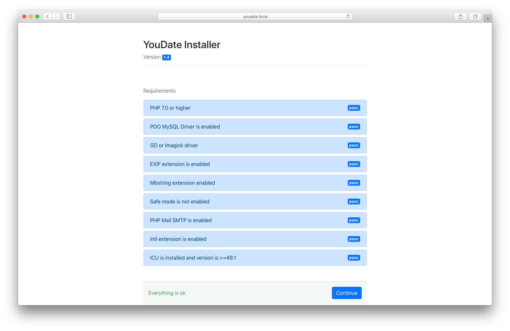
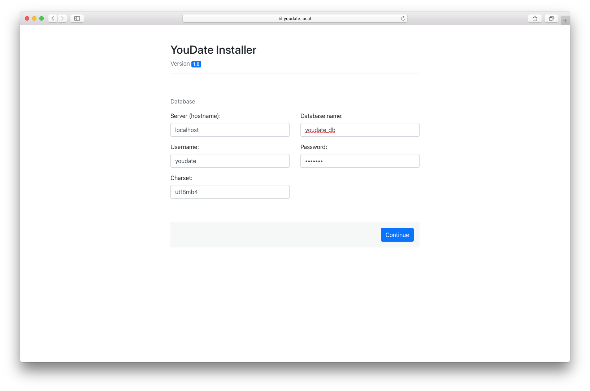
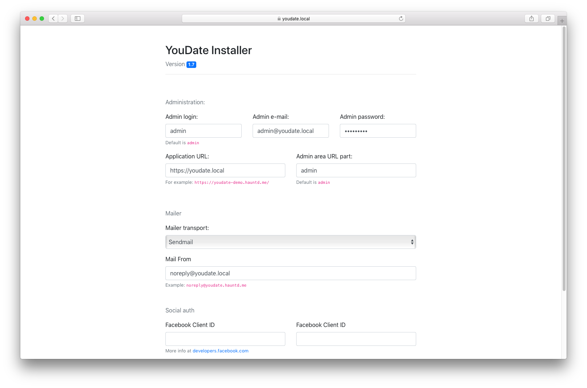
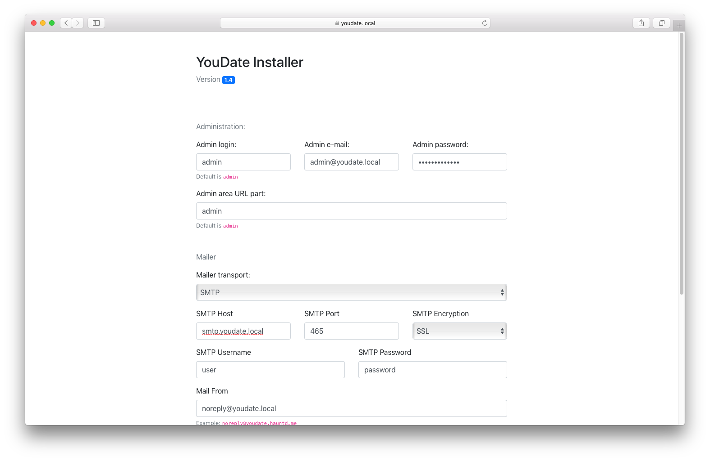

### Requirements check

After uploading files to your web-server/hosting, open your website in the browser. 

!!! note "Website URL"

    In this and the following examples it is `https://youdate.local`.

You will see the initial state of the installation - requirements check page. 

Make sure that everything is ok (all checks pass) and click the "Continue" button.

### Database

The next step is to configure the database.
You must create a database for your script manually (the installer <strong>will not</strong> create it for you).
Then fill out the form and click the "Continue" button.
This action will check the database credentials and import the SQL dump (structure + minimum data).

### Configuration

The next step is to create a config file. This action will verify configuration values, create admin user account and write core config params to the file `.env` file.

!!! note "Notes"

    **Admin URL** - administration area URL. If set to **"admin"**, then your administration URL will be like: 
    
    `https://youdate.local/admin`.
    
    **Mailer transport** - method to deliver mails. SMTP is recommended (see screenshot). In case when SMTP or Sendmail are failing to deliver e-mails, try `Mail transport`.
    
    **Facebook App ID and Secret** - required for Facebook Login. Visit <a href="https://developers.facebook.com/">developers.facebook.com</a>, follow the manuals, create an app and get the credentials.
    URI for OAuth redirection should be like this:
     
    `https://youdate.local/auth/facebook`

    **Twitter Consumer Key and Secret** - required for Twitter Login. Visit <a href="https://developer.twitter.com/">developer.twitter.com</a>, follow the manuals, create an app and get the credentials.
    URI for OAuth redirection should be like this: 
    
    `https://youdate.local/auth/twitter`

Fill the form, click **Finish** button. Script is almost ready to use. Next step is to configure [cron](./cron.md) commands.

