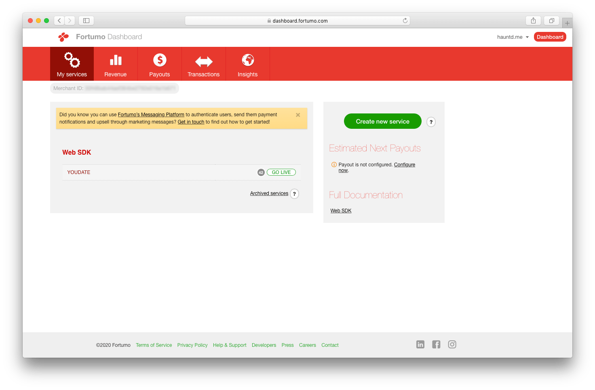

## Sign up

Create account if you don't have any: https://dashboard.fortumo.com/register

## Fortumo Web SDK Service

You need to setup a Web SDK service.

- Navigate to your [services dashboard](https://dashboard.fortumo.com), click **"Create new service"** button:

[](./images/fortumoDashboard.png)

- Select Web SDK service:

[](./images/fortumoService1.png)

- Select countries you want to work with:

[](./images/fortumoService2.png)

- Setup your business relations (according to your requirements):

[](./images/fortumoService3.png)

- Next, check **"Virtual credits"** option (and set name = "credits"):

[](./images/fortumoService4.png)

- Set pricing. **Note**, that Fortumo has its own pricing, it's not related to YouDate pricing.

[](./images/fortumoService5.png)

- Click **"Next"** button. Fill the name fields and URLS:

!!! Important danger
    **Payment URL** must end with ```/balance/fortumo```. 
    
    For example: https://youdate.test/balance/fortumo
    
    **Redirect URL** must end with ```/balance/fortumo-succcess```. 
    
    For example: https://youdate.test/balance/fortumo-success

    
[](./images/fortumoService6.png)
[](./images/fortumoService7.png)
[](./images/fortumoService8.png)

- After service creation, navigate to **General** tab and copy "Service ID" and "Secret" params:

[](./images/fortumoService9.png)


!!! note "Notes"

    You don't need generated HTML code snippet (button)
    
## Service credentials

In YouDate admin area (*Admin > Settings > Payment settings*) you only need to set service ID and secret params:

**By default, Fortumo will work in test mode.** Try to create test payments, and if everything is ok - go live (Fortumo Dashboard).

[](./images/fortumoAdmin.png)

## Additional info

!!! Links

    - Account creation: https://merchants.fortumo.com/getting-started/creating-an-account/
    - Web SDK service creation: https://merchants.fortumo.com/integration-and-testing/web/creating-web-sdk-service/
