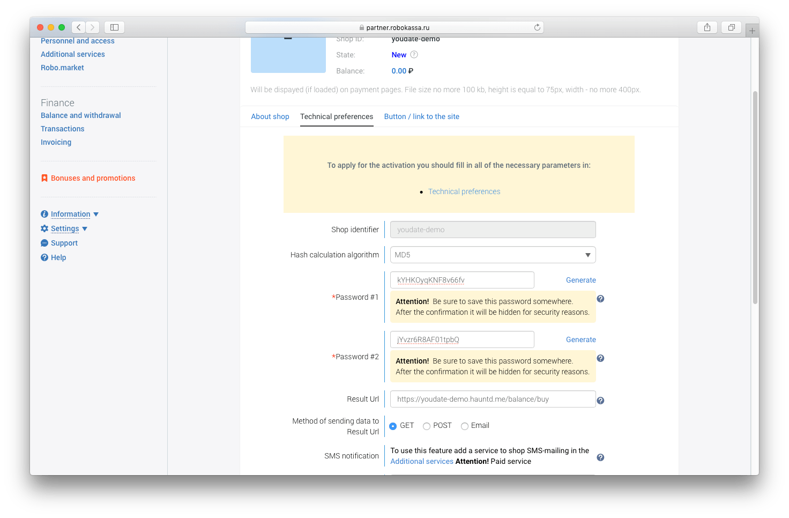

## Sign up

Create account if you don't have any: https://partner.robokassa.ru/Reg/Register

[](./images/robokassaSignup.png)


## Setup a new shop

- Navigate to your [shops dashboard](https://partner.robokassa.ru/Shops), click [**"Add new"**](https://partner.robokassa.ru/Shops/Add) button:

[](./images/robokassaShops.png)

- Fill the form, and click **Create** button:

[](./images/robokassaShop1.png)

- Next form is important (credentials and URLs):

[](./images/robokassaShop2.png)
[](./images/robokassaShop3.png)

!!! Important
    
    - **Shop identifier** parameter will be used later as **Merchant Login**
    - **Result URL** must end with ```/balance/buy```. For example: https://youdate-demo.hauntd.me/balance/buy
    - **Method of sending data to Result URL** must be **GET**
    - **Success URL**  must end with ```/balance/robokassa-success```. For example: https://youdate-demo.hauntd.me/balance/robokassa-success
    - **Method of sending data to Success URL** must be **POST**   
    - **Fail URL**  must end with ```/balance/robokassa-failure```. For example: https://youdate-demo.hauntd.me/balance/robokassa-failure
    - **Method of sending data to Fail URL** must be **POST**
    - **Hash calculation method** is **MD5** or any other available

- Also, you may want to test payments before going live. Generate passwords for testing payments:

[](./images/robokassaShop4.png)

    
## Service credentials

In YouDate admin area (*Admin > Settings > Payment settings*) setup Robokossa integration:

[](./images/robokassaAdmin.png)

!!! Notes
    - **Merchant login** is the same, as **Shop Identifier**
    - Test payments and Live payments use different *password1* and *password2*
    - **Hashing algorithm** must be the same as you have set in Robokassa Shop settings

## Additional info

!!! Links

    - Robokassa Documentation: https://docs.robokassa.ru/en/
    - Робокасса Документация: https://docs.robokassa.ru
    