## Sign up

Create account if you don't have any: https://dashboard.stripe.com/register

[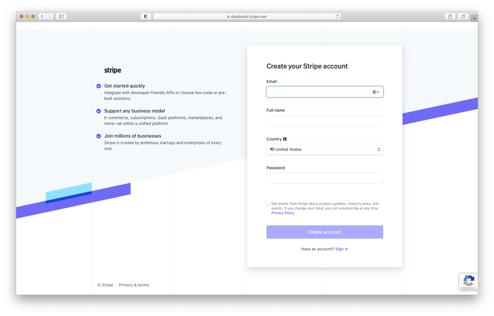](./images/stripe1.png)

## Stripe Business setup

After sign up, you'll have a screen like this:

!!! Note
    By default your account will be in **test** mode.

[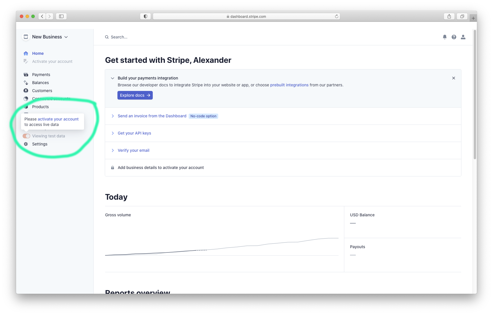](./images/stripe2.png)

Click on **"New Business"** button, fill the form, and click **"Create account"** button:

[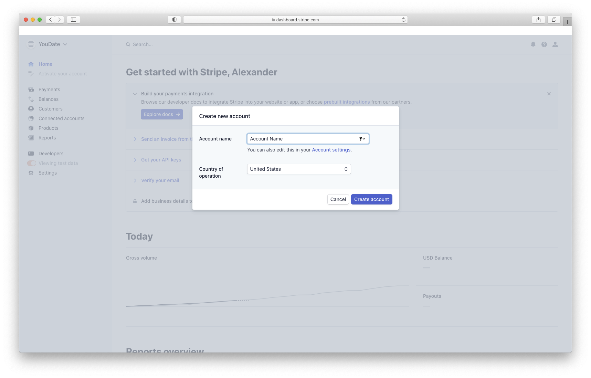](./images/stripe3.png)

Now you should have an individual account for your website ("YouDate" in this example)

[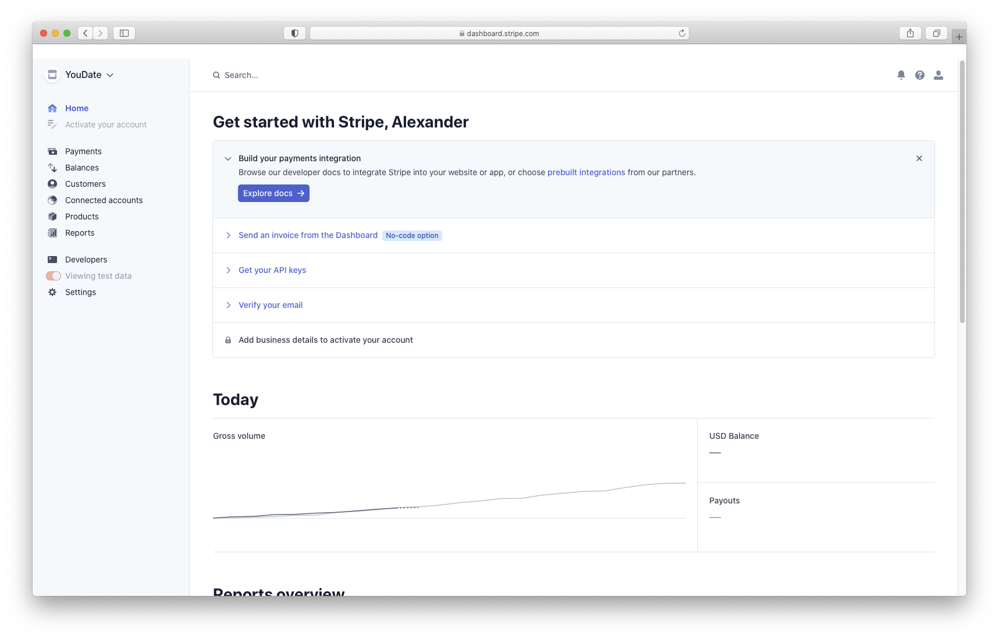](./images/stripe4.png)

Then, navigate to menu section **Developers > API keys**.
Click on **Publishable Keys** and **Secret key**. Copy these keys somewhere.

[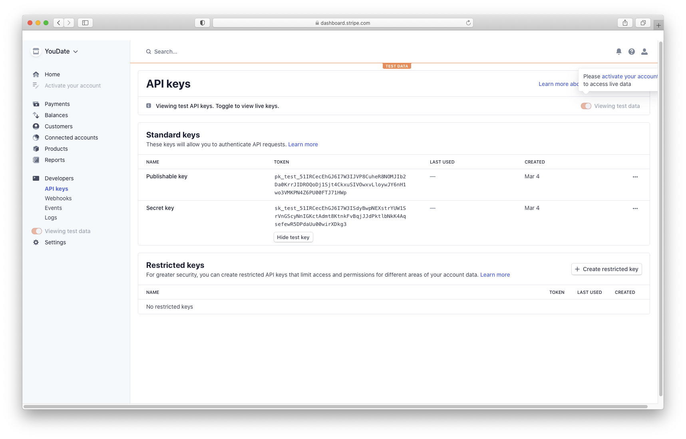](./images/stripe5.png)

!!! Important

    Keys that start with **sk_test**, **pk_test** are for development and testing purposes only!

After copying the API keys you need to add a webhook. Navigate to **Developers > Webhooks**, and click on **Add endpoint** button:

[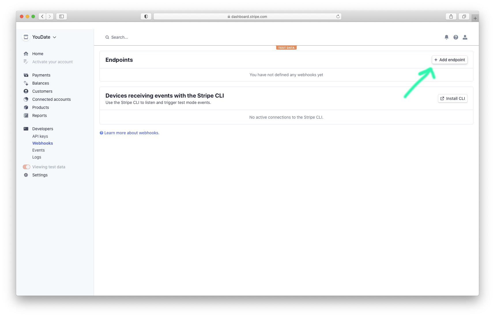](./images/stripe6.png)

Fill the form and selecting required events, click **Add endpoint**:

!!! Important

    - **Endpoint URL** should be like this: https://youdate.test/balance/stripe-webhook (set your own domain instead of **youdate.test**).
    - **Description** optional
    - **Events to send**: select ALL **Charge** and **Checkout** events

[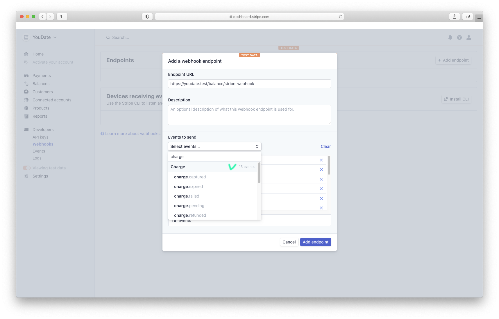](./images/stripe7.png)
[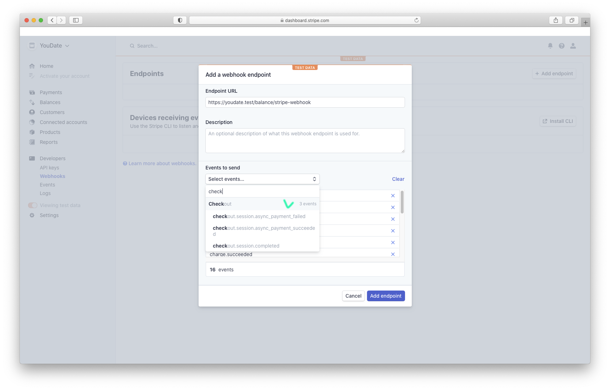](./images/stripe8.png)

After creating endpoint you'll have a screen like this:

[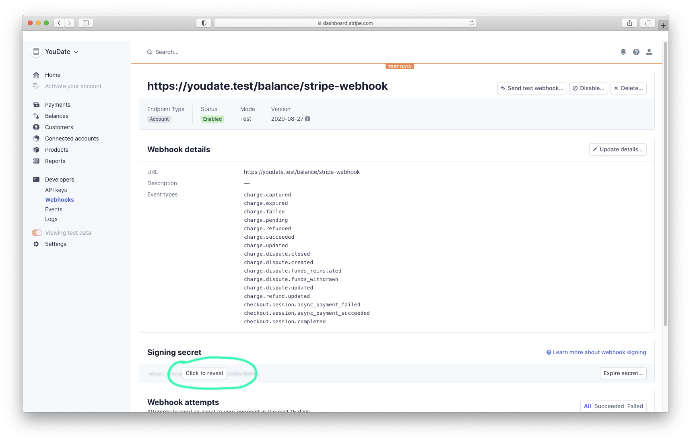](./images/stripe9.png)
[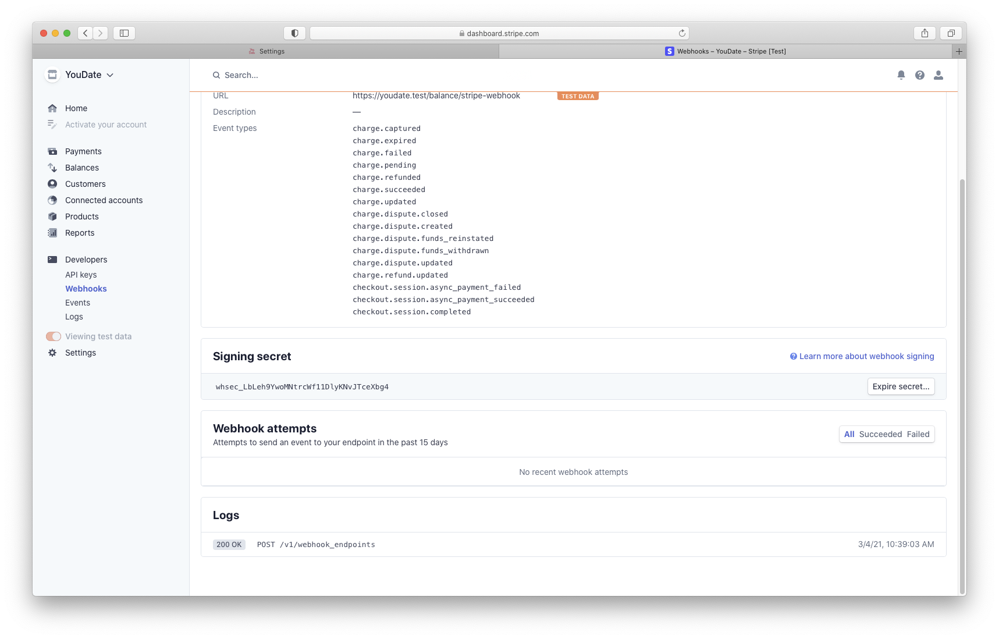](./images/stripe10.png)

Click on **"Signing secret"** field, copy **Signing secret** key.

## Service credentials

In YouDate admin area (*Admin > Settings > Payment settings*) setup Stripe integration:

- **Publishable key** (begins with pk_)
- **Secret key** (begins with sk_)
- **Webhook secret** (begins with wh_)

[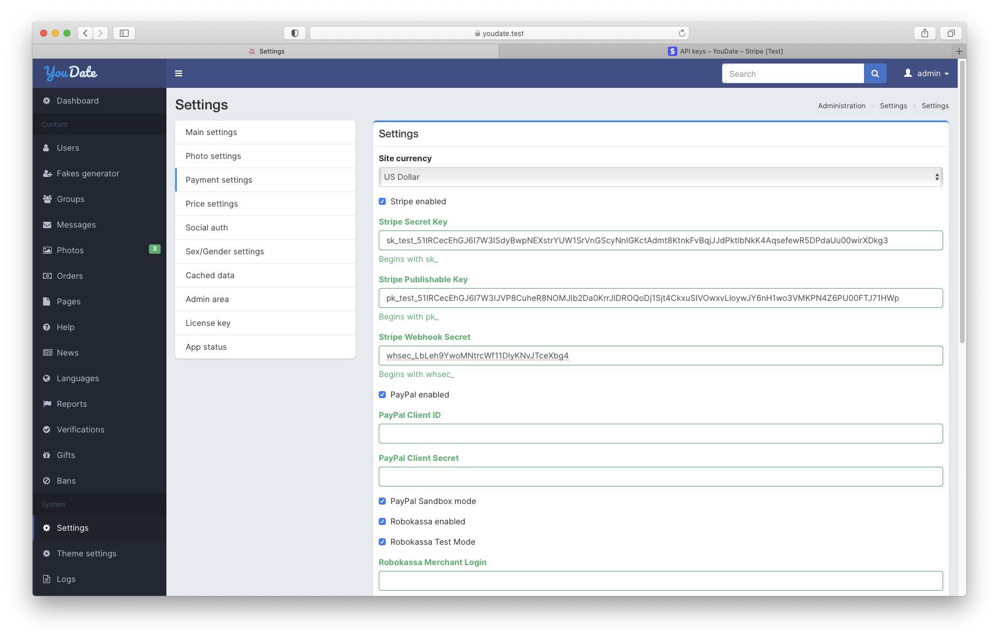](./images/stripe11.png)

## Going live

- Activate your Stripe account.

[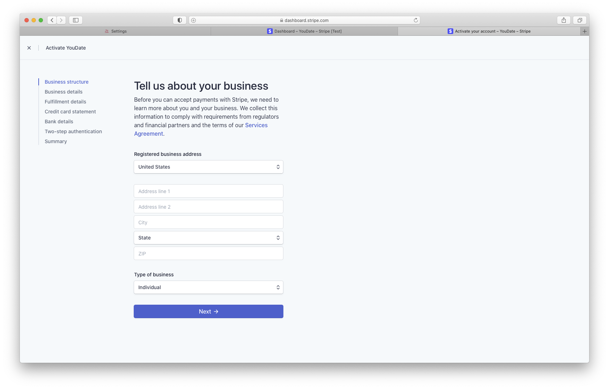](./images/stripe11.png)

- After account activation you'll be able to disable **"Test data"** toggle (sidebar).

- Unselect **Viewing test data** toggle and repeat the same steps. For now, you'll get keys without **_test** prefix.

## Additional info

!!! Links

    - Stripe Documentation: https://stripe.com/docs
    